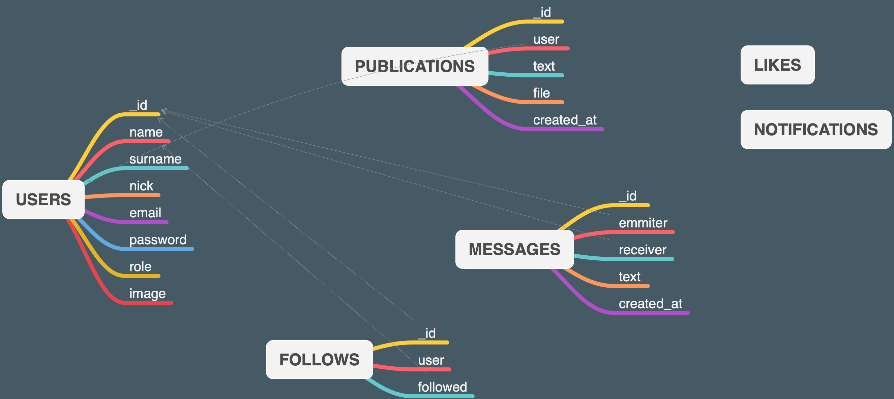

# README
## Project 3
### Introduction

This is my project 3. Developing my first web app.

### Requirements
There is no requirements for this project.

### Installation
There is no need to install. The web app will work on a website.

### Development
#### Data Base
MongoDB
#### Diagram of Data Base
Using MindNode to draw the diagram of data base.

#### Language
JavaScrip, using NodeJS and Angular.

### Configuration
Your will need:

* Create your user

### Troubleshooting & FAQ
Just write and ask: daniel@wedapp.io

### Maintainers
Daniel Alves - Twitter [@wedapp_](https://twitter.com/wedapp_)

This project has been developed without sponsors.

## Don't forget
> Mi trabajo no es caer bien a la gente. Mi trabajo es hacerles mejores. Steve Jobs

### wedapp
Daniel Alves